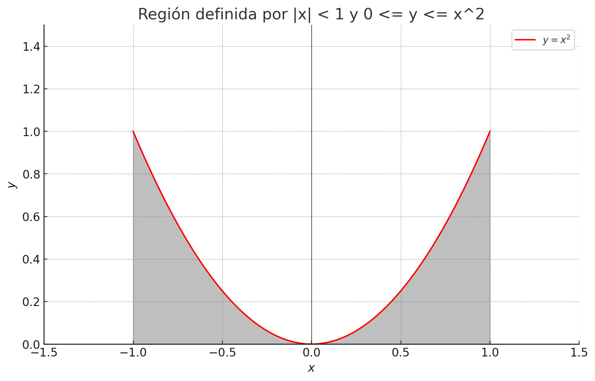

Alejandro Echevarría Brunet

# CP\#9: Vectores Aleatorios Continuos

## Ejercicio 1:
La función de densidad de un vector aleatorio continuo es:

$$
\begin{cases}
xe^{-(x+y)},    & \text{si } x,y \geq 0 \\
0,              & \text{en otro caso}
\end{cases}
$$

a) Halle las funciones de distribución marginal.
b) Determine si $X$ e $Y$ son independientes.
c) Determine $\rho(X,Y)$.

### Solución:

a) De [[Vectores Aleatorios Continuos#Definición 3 (Función de Distribución Marginal)]] tenemos

$$
F_X(x) = \int_{0}^{x} f_X(t)dt
$$

$$
F_Y(y) = \int_{0}^{y} f_Y(t)dt
$$

Hallando $f_X(x)$:

$$
f_X(x) = \int_{0}^{+\infty} xe^{-(x+y)}dy 
$$

$$
= xe^{-x} \int_{0}^{+\infty} e^{-y}dy
$$

$$
-xe^{-x}    \left[ e^{-y}\big|_0^{+\infty} \right] = -xe^{-x} \cdot \left( \cancel{\lim_{x \to +\infty}e^{-y}}^{0, x \to +\infty} - e^{0} \right) = -xe^{-x} \cdot (-1) = \boxed{xe^{-x}}
$$

Hallando $f_Y(y)$:

$$
f_Y(Y) = \int_{0}^{+\infty} xe^{-(x+y)}dx
$$

$$
= e^{-y} \int_{0}^{+\infty}xe^{-x}dx 
$$

> Sust. por partes:
>   $u = x$
>   $du = dx$
>   $dv = e^{-x}$
>   $v=-e^{-x}$

$$
=e^{-y} \left( -xe^{-x} - \int_{0}^{+\infty} -e^{-x}dx \right) = e^{-y} \left( -xe^{-x} + \int_{0}^{+\infty} e^{-x}dx \right)
$$

$$
= e^{-y} ( -xe^{-x} + -e^{-x}) \Big|_{0}^{+\infty} = e^{-y} \left( \left [ \cancel{\lim_{x \to +\infty} (-xe^{-x} -e^{-x} )}^{0, x \to +\infty} \right] + 0 \cdot e^{0} + e^0 \right )
$$

$$
= \boxed{e^{-y}}
$$

Hallemos $F_X(x)$:

$$
F_X(x) = \int_{0}^{x} f_X(t)dt = \int_{0}^{x} te^{-t}dt
$$

> Sust. por partes:
> $u = t$
> $du = dt$
> $dv = e^{-t}dt$
> $v = -e^{-t}$

$$
= -te^{-t} - \int_{0}^{x} -e^{-t}dt = -te^{-t} + \int_{0}^{x} e^{-t}dt
$$

$$
= (-te^{-t}-e^{-t})\Big|_{0}^{x} = -xe^{-x}-e^{-x} + 0 \cdot e^{0} + e^{0}
$$

$$
= \boxed{-xe^{-x} - e^{-x} + 1}
$$

Hallemos $F_Y(y)$:

$$
F_Y(y) = \int_{0}^{y} f_Y(t)dt = \int_{0}^{y} e^{-t}dt = -e^{-t}\Big|_{0}^{y} = \boxed{-e^{-y} + 1}
$$

b) $f(x,y) \stackrel{?}{=} f_X(x)f_Y(y)$:

$$
xe^{-(x+y)} \stackrel{?}{=} xe^{-x} \cdot e^{-y}
$$

$$
xe^{-(x+y)} = xe^{-(x+y)}
$$

$\therefore$ Son independientes 

c) Como $X$ e $Y$ independientes $\implies Cov(X,Y) = 0 \implies \rho = 0$ 

## Ejercicio 2:

Sea $(X,Y)$ un vector aleatorio continuo cuya función de densidad $f(x,y) = k$ está definida en la región limitada por las rectas: $x = 0$, $y = 0$, $x + y = 1$.

a) Encuentre el valor de $k$.
b) Calcule $P \left( X > 0, Y < \frac{1}{2} \right)$.
c) Calcule $V(X)$.

### Solución:

a) Recordemos que por propiedad 1 de [[Vectores Aleatorios Continuos#Propiedades de los Vectores Aleatorios]]

$$
\int_{-\infty}^{+\infty}\int_{-\infty}^{+\infty}f(x,y)dxdy = 1
$$

$$
\int_{0}^{1}\int_{0}^{1-x}kdydx = 1
$$

$$
\implies \int_{0}^{1} \left( ky\Big|_{0}^{1-x} \right) dx = 1
$$

$$
\implies \int_{0}^{1} k(1-x)  dx = 1
$$

$$
\implies -k\frac{(1-x)^2}{2}\Big|_{0}^{1}dx = 1
$$

$$
\implies -k \left[ \frac{(1-1)^2}{2} - \frac{1^2}{2} \right]  dx = 1
$$

$$
\implies k = \boxed{2}
$$

b) Hallemos $P(X > 0, Y < \frac{1}{2})$:

$$
\int_{0}^{\frac{1}{2}}\int_{0}^{1-y}f(x,y)dxdy = \int_{0}^{\frac{1}{2}}\int_{0}^{1-y}2dxdy = \boxed{\frac{3}{4}} 
$$

c) Recordemos que $V(X) = E[X^2] - (E[X])^2$.

Hallemos $E[X]$:

$$
E[X] = \int_{0}^{1} x f_X(x) dx
$$

donde:

$$
f_X(x) = \int_{0}^{1-x}f(x,y)dy = \int_{0}^{1-x} 2dy = \boxed{2(1-x)}
$$

por lo que 

$$
E[X] = \int_{0}^{1} x f_X(x) dx = \int_{0}^{1}2x(1-x)dx = \int_{0}^{1} 2x-2x^2 dx = \left (x^2 - \frac{2x^3}{2} \right) \Big|_{0}^{1} = \boxed{\frac{1}{3}}
$$

Hallemos $E[X^2]$:

$$
E[X] = \int_{0}^{1} x^2 f_X(x) dx = \int_{0}^{1}2x^2(1-x)dx = \int_{0}^{1} 2x^2 - 2x^3 dx = \left( \frac{2x^3}{3} - \frac{x^4}{2} \right) \Big|_{0}^{1} = \frac{1}{6}
$$

Volviendo a la ecuación principal:

$$
V(X) = E[X^2] - (E[X])^2 = \frac{1}{6} - (\frac{1}{3})^2 = \boxed{\frac{1}{18}}$$

## Ejercicio 3:

Sea $(X,Y)$ un vector aleatorio con función de densidad conunta:

$$
f(x,y) = 
\begin{cases}
    \frac{y}{2x},   & \text{ si } 1 \leq x \leq e, 0 \leq y \leq a \\
    0,              & \text{ en otro caso }
\end{cases}
$$

a) Determine el valor de la constante $a$.
b) Halle las funciones de densidad marginal de $X$ e $Y$.
c) Calcule $P(X > Y)$.
d) Determine $E[X]$ y $V(X)$.

### Solución:

a) Para determina el valor de $a$ recordemos que $P(\Omega) = 1$:

$$
\int_{0}^{a} \int_{1}^{e} f(x,y) dx dy = 1
$$

$$
\int_{0}^{a} \int_{1}^{e} \frac{y}{2x} dx dy = 1
$$

$$
\int_{0}^{a} \frac{y}{2} dy = 1
$$

$$
\frac{y}{2}\Big|_{0}^{a} dy = 1
$$

$$
\frac{a^2}{4} = 1
$$

$$
\implies \boxed{a = 2}
$$

b) Hallemos las Funciones de densidad marginal

Para $X$:

$$
f_X(x) = \int_{0}^{2} f(x,y)dy = \int_{0}^{2} \frac{y}{2x} dy = \frac{y^2}{4x} \Big|_{0}^{2} = \boxed{\frac{1}{x}}
$$

Para $Y$:

$$
f_Y(y) = \int_{0}^{e} f(x,y) dx = \int_{0}^{e} \frac{y}{2x} dx = \frac{y}{2}\ln x \Big|_{0}^{e} = \boxed{\frac{y}{2}}
$$

c) $P(X > Y) = 1 - P(X \leq Y)$:

$$
P(X \leq Y) = \int_{1}^{2}\int_{1}^{y} f(x,y)dxdy = \int_{1}^{2}\int_{1}^{y} \frac{y}{2x} dxdy
$$

$$
= \int_{1}^{2}\frac{y}{2} \left(  \ln x \Big|_{1}^{y} \right) dy =\int_{1}^{2}\frac{y}{2} \ln y dy 
$$

> $u = \ln y$
> $du = \frac{1}{y} dy$
> $dv = \frac{y}{2} dy$
> $v = \frac{y^2}{4}$

$$
= \frac{y^2}{4} \ln y - \int \frac{y^2}{4}\frac{1}{y} dy = \frac{y^2}{4} \ln y - \int \frac{y}{4}dy 
$$

$$
= \left( \frac{y^2}{4} \ln y - \frac{y^2}{8} \right)\Big|_{1}^{2} = \ln 2 - \frac{3}{8}
$$

Volviendo a la ecuación principal:

$$
P(X > Y) = 1 - P(X \leq Y) = 1 - \left( \ln 2 - \frac{3}{8} \right) = \boxed{\frac{11}{8} - \ln 2}
$$

d) Hallemos $E[X]$:

$$
E[X] = \int_{1}^{e} x f_X(x)dx = \int_{1}^{e} x \frac{1}{x} dx = \int_{1}^{e} dx = x \Big|_{1}^{e} = \boxed{e - 1} 
$$

Para calcular $V(Y)$ necesitamos $E[Y]$ y $E[Y^2]$.

Hallemos $E[Y]$:

$$
E[Y] = \int_{0}^{2}yf_Y(y)dy = \int_{0}^{2} y \frac{y}{2} dy = \int_{0}^{2} \frac{y^2}{2} dy = \frac{y^3}{6} \Big|_{0}^{2} = \boxed{\frac{8}{6}}
$$

Hallemos $E[Y^2]$:

$$
E[Y^2] = \int_{0}^{2} y^2 f_Y(y) dy = \int_{0}^{2} y^2 \frac{y}{2} dy = \int_{0}^{2} \frac{y^3}{2} dy = \frac{y^4}{8} \Big |_{0}^{2} = \boxed{2}
$$

Por tanto

$$
V(Y) = E[Y^2] - (E[Y])^2 = 2 - \left( \frac{8}{6} \right)^2 = 2 - \frac{64}{36} = \boxed{\frac{2}{9}} 
$$

## Ejercicio 4:

Sea $(X,Y)$ un vector aleatorio con función de densidad conjunta:

$$
f(x,y) = 
\begin{cases}
\frac{1}{2x^2}, & |x| < 1, 0 \leq y \leq x^2 \\
0, & \text{ en otro caso. }
\end{cases}
$$

a) Halle las funciones de densidad marginal de $X$ e $Y$.
b) Calcule $P(Y > 0.25)$ y $P(X > -0.5, Y < 0.64)$
c) Diga si las variables son independientes.

### Solución:

a) La región que se plantea se representa más o menos geométricamente de la siguiente forma:

$$
f_X(x) = \int_{0}^{x^2}f(x,y)dy = \int_{0}^{x^2} \frac{1}{2x^2} dy = \frac{y}{2x^2} \Big |_{0}^{x^2} = \boxed{\frac{1}{2}}
$$

$$
f_Y(y) = 2 \cdot \int_{\sqrt{y}}^{1} f(x,y)dx = 2 \cdot \int_{\sqrt{y}}^{1} \frac{1}{2x^2}dx
$$

$$
2 \cdot \left( -\frac{1}{2x} \right)\Big|_{\sqrt{y}}^{1} = \frac{1}{\sqrt{y}} - 1
$$

b) Hallemos $P\left(Y > \frac{1}{4}\right)$

$$
P\left(Y > \frac{1}{4}\right) = 2 \cdot \int_{\frac{1}{2}}^{1}\int_{0}^{x^2} f(x,y)dydx = 2 \cdot \int_{\frac{1}{2}}^{1}\int_{0}^{x^2} \frac{1}{2x^2}dydx
$$

$$
= 2 \cdot \int_{\frac{1}{2}}^{1}\int_{\frac{1}{4}}^{x^2} \left( \frac{y}{2x^2}\Big|_{\frac{1}{4}}^{x^2} \right) dx = 2 \cdot \int_{\frac{1}{2}}^{1}\frac{1}{2} - \frac{1}{8x^2} dx = 2 \cdot \left( \frac{x}{2} + \frac{1}{8x} \right) \Big|_{\frac{1}{2}}^{1}
$$

$$
2 \cdot \left( \frac{1}{2} + \frac{1}{8} - \frac{1}{4} - \frac{1}{4} \right) = \boxed{\frac{1}{4}} 
$$

Hallemos $P\left( X > -\frac{1}{2}, Y < \frac{16}{25} \right) $:

$$
P\left( X > -\frac{1}{2}, Y < \frac{16}{25} \right) = \int_{-\frac{1}{2}}^{\frac{4}{5}} \int_{0}^{x^2} f(x,y)dydx + \int_{\frac{4}{5}}^{1} \int_{0}^{\frac{16}{25}} f(x,y)dydx 
$$

$$
= \int_{-\frac{1}{2}}^{\frac{4}{5}} \int_{0}^{x^2} \frac{1}{2x^2}dydx + \int_{\frac{4}{5}}^{1} \int_{0}^{\frac{16}{25}} \frac{1}{2x^2}dydx
$$

$$
= \int_{-\frac{1}{2}}^{\frac{4}{5}} \left( \frac{y}{2x^2} \right)\Big|_{0}^{x^2}dx + \int_{\frac{4}{5}}^{1} \left( \frac{y}{2x^2} \right)
\Big|_{0}^{\frac{16}{25}}dx
$$

$$
= \int_{-\frac{1}{2}}^{\frac{4}{5}} \frac{1}{2} dx + \int_{\frac{4}{5}}^{1} \frac{16}{50x^2} dx
$$

$$
= \left(\frac{x}{2}\right)\Big|_{-\frac{1}{2}}^{\frac{4}{5}} + \left(-\frac{16}{50x}\right)\Big|_{\frac{4}{5}}^{1}
$$

$$
\frac{4}{10} + \frac{1}{4} + \left( - \frac{16}{50} + \frac{80}{200}\right) = \boxed{\frac{73}{100}}
$$
 
c)

$$
\text{  } f(x,y) \stackrel{?}{=} f_X(x)f_Y(y)
$$

$$
\frac{1}{2x^2} \neq \left( \frac{1}{2} \right) \left( \frac{1}{\sqrt{y}} - 1\right)
$$

$\therefore$ No son independientes.

## Ejercicio 5:

La función de densidad de un vector aleatorio continuo es:

$$
f(x,y) = c(x+y)I_A(x,y)
$$

$$
A = \set{(x,y) : 0 \leq y \leq x \leq 2}
$$

a) Determine el valor de la constante c.
b) Halle las funciones de densidad marginal en cada caso.
c) Determine la función de densidad condicional de $X$ dado $Y = y$.
d) Calcule $P\left(X > \frac{1}{2} | Y = \frac{1}{5} \right)$.
e) Determine si las variables $X$ e $Y$ son independientes.

### Solución:

a) 

$$
\int_{0}^{2}\int_{0}^{x}f(x,y)dydx = 1
$$

$$
\int_{0}^{2}\int_{0}^{x} c(x+y)dydx = 1
$$

$$
c \cdot \int_{0}^{2}\int_{0}^{x}(x+y)  dydx = 1
$$

$$
c \cdot \int_{0}^{2} \left( yx + \frac{y^2}{2} \right)\Big|_{0}^{x} dx = 1
$$

$$
c \cdot \int_{0}^{2} x^2 + \frac{x^2}{2} dx = 1
$$

$$
c \cdot \left( \frac{x^3}{3} + \frac{x^3}{6} \right) \Big |_{0}^{2} = 1
$$

$$
c \cdot \left( \frac{8}{3} + \frac{8}{6}\right) = 1
$$

$$
c \cdot \frac{24}{6} = 1
$$

$$
\implies \boxed{c = \frac{1}{4}}
$$

Por lo que la función quedaría definida de la siguiente forma:

$$
f(x,y,) = \frac{1}{4}(x+y)I_A
$$

b) Funciones de Densidad Marginal

Para $X$:

$$
f_X(x) = \int_{0}^{x} \frac{1}{4}(x+y)dy = \int_{0}^{x} \frac{1}{4}x + \frac{1}{4}y dy 
$$

$$
\left( \frac{1}{4}xy + \frac{y^2}{8} \right) \Big|_{0}^{x} = \frac{x^2}{4} + \frac{x^2}{8} = \boxed{\frac{3x^2}{8}}
$$

Para $Y$:

$$
f_Y(y) = \int_{y}^{2} \frac{1}{4}(x+y) dx = \left( \frac{x^2}{8} + \frac{xy}{4}\right)\Big|_{y}^{2} = \frac{4}{8} + \frac{2y}{4} - \frac{y^2}{8} - \frac{y^2}{4} = \boxed{\frac{4 + 4y -3y^2}{8}}
$$

c) 

$$
f(X | Y = y_i) = \frac{f(x, y_i)}{f_Y(y_i)} = \frac{\frac{1}{4}(x + y_i)}{\frac{4 + 4y_i -3y_i^2}{8}} = \boxed{\frac{2(x+y_i)}{4+4y_i-3y_i^2}}
$$

d) Hallemos $P\left(X > \frac{1}{2} | Y = \frac{1}{5} \right)$:

$$
P\left(X > \frac{1}{2} \Big| Y = \frac{1}{5} \right) =  \int_{\frac{1}{2}}^{2}\frac{2(x+ \frac{1}{5})}{4+4 \cdot \frac{1}{5} - 3 \cdot \left( \frac{1}{5} \right)^2} dx
$$

$$
\int_{\frac{1}{2}}^{2} \frac{2x + \frac{2}{5}}{4 + \frac{4}{5} - \frac{3}{25}} dx = \int_{\frac{1}{2}}^{2} = \frac{50}{117} \left( x + \frac{1}{5} \right)dx = \left( \frac{50}{234}x^2 + \frac{50}{585}x \right) \Big|_{\frac{1}{2}}^{2}
$$

$$
\frac{200}{234} + \frac{100}{585} - \frac{50}{936} - \frac{50}{1170} = \boxed{\frac{145}{156}}
$$

e) 
$$
f(x,y) \stackrel{?}{=} f_X(x)f_Y(y)
$$

$$
\frac{1}{4}(x+y) \stackrel{?}{=} \frac{3x^2}{8} \cdot \left( \frac{4+4y-3y^2}{8} \right)
$$

$$
\frac{1}{4}(x+y) \neq \frac{12x^2+12x^2y-9x^2y^2}{64}
$$

$\therefore$ No son independientes.